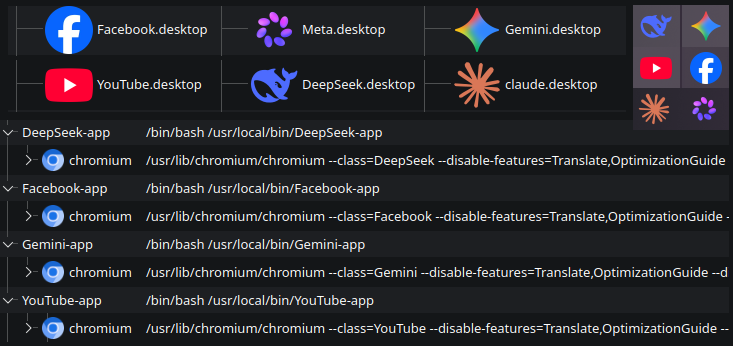

# webapp-gen

Create isolated web apps from any website using Chromium in `--app` mode. Each app has its own profile, icon, `.desktop` entry and shows as a separate process tree `app-name-app → chromium` in btop/htop.

<p align="center">

</p>

**[English] | [Polski](README_pl.md)**

## Features

- **Separate process** - wrapper `~/.local/bin/webapp-list/app-app` keeps all chromium processes under one parent, visible in process managers
- **Separate data** - each app has its own `~/.config/app-app/` profile, cookies, storage
- **Proper desktop integration** - `.desktop` file with `StartupWMClass` for correct icon grouping on X11 and Wayland
- **Custom flags** - choose Chromium flags per app + your own `CUSTOM_FLAGS`
- **No root needed** - everything lives in `~/.local` and `~/.config`
- **i18n** - Polish / English, chosen on first run

## Installation

No root, no `pkexec`, no polkit required.

```bash
git clone https://github.com/KamiLulek/webapp-gen
cd webapp-gen
mkdir -p ~/.local/bin/webapp-list
cp webapp-gen ~/.local/bin/
chmod +x ~/.local/bin/webapp-gen
```

Make sure `~/.local/bin` is in your PATH:

```bash
# bash
echo 'export PATH="$HOME/.local/bin:$PATH"' >> ~/.bashrc
source ~/.bashrc

# zsh
echo 'export PATH="$HOME/.local/bin:$PATH"' >> ~/.zshrc
source ~/.zshrc

# fish
fish_add_path ~/.local/bin
```

**Requirements:**
- Chromium or Chromium-based browser (`chromium`, `google-chrome`, `brave`, etc.)
- `update-desktop-database` (optional, for menu refresh)

## Usage

```bash
 =======================-------- 
 ===   webapp-gen
 ==================== + + v0.9.1 

 1. Install new app
 2. List (Info/Edit/Remove)
 3. Settings
 4. Exit / Q = Exit

 Choose option [1-4] or 'q' to quit:
```

### 1. Install new app
1. `Name (no spaces)` - only `a-zA-Z0-9_-`, e.g. `youtube`, `claude`, `gmail`
2. `URL` - e.g. `https://youtube.com`
3. Chromium flags selection - Y/n prompts
4. Custom flags - your own extra flags (ENTER = skip)
5. Icon - filename from default icon folder or full path. Copied to `~/.local/share/icons/webapp-ico/`

### 2. List (Info/Edit/Remove)
New in 0.9-alpha - unified view.

```
 =======================-------- 
 ===   Installed 
 ==================== + + v0.9.1 

 1. google
 2. youtube


 p - back 
 q - quit 

 Select app number (p=back, q=quit):
```

After selecting:

```
 =======================-------- 
 ===   Details 
 ==================== + + v0.9.1 

  Name: youtube
  URL: https://youtube.com
  Icon: /home/user/.local/share/icons/webapp-ico/youtube.png
  Wrapper: /home/user/.local/bin/webapp-list/youtube-app
  Desktop: /home/user/.local/share/applications/youtube.desktop
  Config: /home/user/.config/webapp-gen/apps/youtube.cfg
  Flags: --disable-features=Translate,OptimizationGuide --disable-background-networking
  Custom: --force-device-scale-factor=1.25

--- Actions ---

  e - Edit
  r - Remove
  p - Back to list
  q - Quit
```

- `e` - Edit: change URL (ENTER to keep), re-select flags, edit custom flags with `ENTER=keep / n=new / c=clear`, optionally change icon.
- `r` - Remove with confirmation `[y/N]`.
- `p/q` - navigation.

### 3. Settings
Change language `pl/en` and default icon path. Stored in `~/.config/webapp-gen/config.cfg`.

On first run:

```
 ╔════════════════════════════════════════╗
 ║          webapp-gen - FIRST RUN        ║
 ╚════════════════════════════════════════╝

 Select language / Wybierz język:
  1. Polski
  2. English

 Choose / Wybierz [1-2]: 2

 Selected: English

 Enter default path for icons:
  (ENTER for default: /home/USER)
 Set path: /home/USER/Pictures
```

### CLI shortcuts

```bash
webapp-gen              # interactive menu 1-4
webapp-gen -list        # list + details view e/r/p/q
webapp-gen -edit        # pick app to edit
webapp-gen -remove      # pick app to remove
webapp-gen -config      # settings
webapp-gen -h           # help
```

## Where files are stored

| What | Location | Description |
|---|---|---|
| App wrapper | `~/.local/bin/webapp-list/<name>-app` | Bash script that launches the app |
| App config | `~/.config/webapp-gen/apps/<name>.cfg` | URL, FLAGS, CUSTOM_FLAGS, ICON |
| Desktop entry | `~/.local/share/applications/<name>.desktop` | Menu entry |
| Icon | `~/.local/share/icons/webapp-ico/<name>.*` | Copied icon |
| App data | `~/.config/<name>-app/` | Chromium profile, cookies, storage |
| Script config | `~/.config/webapp-gen/config.cfg` | LANG_CHOICE and DEFAULT_ICON_PATH |

Example `~/.config/webapp-gen/apps/youtube.cfg`:
```ini
NAME="youtube"
URL="https://youtube.com/"
ICON="/home/user/.local/share/icons/webapp-ico/youtube.png"
FLAGS="--disable-features=Translate,OptimizationGuide --disable-background-networking"
CUSTOM_FLAGS="--force-device-scale-factor=1.5"
```

Script config `~/.config/webapp-gen/config.cfg`:
```ini
# webapp-gen config
LANG_CHOICE="en"
DEFAULT_ICON_PATH="/home/user/Pictures"
```

## Chromium Flags

Selected during install/edit via Y/N prompts:

| Flag | Description | Default |
|---|---|---|
| `--disable-features=Translate,OptimizationGuide` | Disables Google Translate and suggestions | ✅ Y |
| `--disable-background-networking` | Disables background networking | ✅ Y |
| `--disable-extensions` | Disables all extensions | ❌ N |
| `--disable-sync` | Disables Google account sync | ❌ N |
| `--disable-gpu` | Disables GPU acceleration | ❌ N |
| `--incognito` | Always start in incognito | ❌ N |
| `--start-maximized` | Start window maximized | ❌ N |

`CUSTOM_FLAGS` are separate - you can add anything:
- `--force-device-scale-factor=1.25`
- `--ozone-platform-hint=auto`

Docs:
- https://peter.sh/experiments/chromium-command-line-switches/
- `chrome://flags`

## How it works

Each app is a bash wrapper generated in `write_app_files()`:

```bash
#!/bin/bash
source "/home/user/.config/webapp-gen/apps/youtube.cfg"
NAME="${NAME:-$NAZWA}" # backwards compat with old NAZWA var
chromium --class="${NAME}" ${FLAGS} ${CUSTOM_FLAGS} --user-data-dir="/home/user/.config/${NAME}-app" --app="${URL}"
```

- The bash process `youtube-app` stays as parent, so in `btop`/`htop` you see `youtube-app → chromium` instead of just `chromium`.
- **X11:** grouping via `StartupWMClass=name` in `.desktop`
- **Wayland:** `app_id` comes from `--class=name`. Combined with `StartupWMClass=name` icon grouping works on GNOME/KDE Wayland.

## License

MIT License - feel free to use and modify!

## Contributing

Pull requests and issues welcome! 🚀
